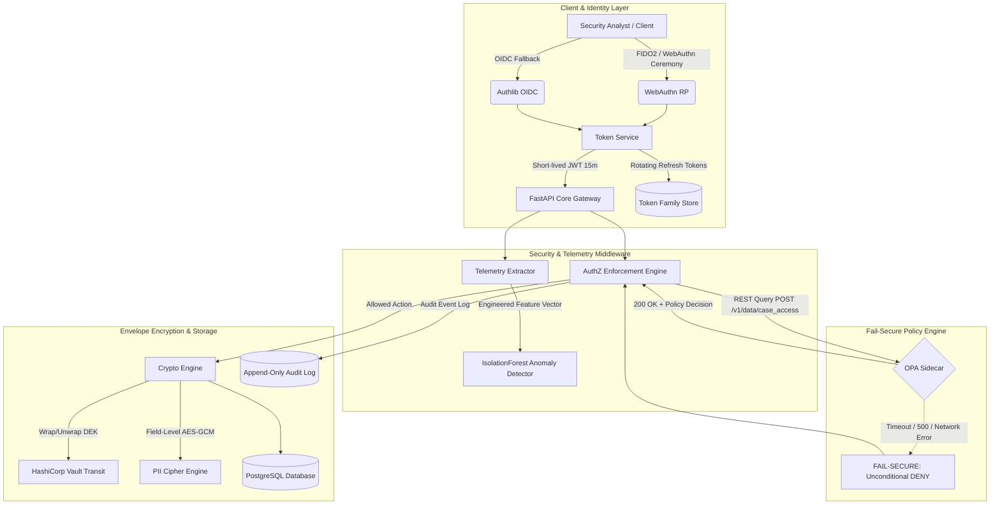

# Zero-Trust Secure Backend & Identity Threat Detection

[](https://github.com/PremKLodhia/zero-trust-secure-backend/actions)
[](#design-philosophy)
[](#architecture--data-flow)
[](#architecture--data-flow)
[](#architecture--data-flow)

A defense-in-depth secure case-file exchange backend for security operations teams. The system implements end-to-end zero-trust controls, cryptographic data protection with HashiCorp Vault, fail-secure policy enforcement via Open Policy Agent (OPA), and behavioural identity threat detection via an IsolationForest ML pipeline.

---

## Design Philosophy

- **Fail-Secure Decision Engine**: Authorization decisions default unconditionally to `DENY`. If Open Policy Agent (OPA) is unreachable, times out, or returns a 500 error, requests are strictly blocked (`HTTP 403 / 503`), never silently allowed through.
- **Empirical Control Validation**: Every control is backed by automated tests, real attack simulators, or actual security scans—not assertions in prose.
- **Transparent Vulnerability Remediation**: Features a genuine deliberate vulnerability exercise (JWT algorithm confusion / `alg: none` bypass), a working exploit script, before/after captures, and remediation diff in [vuln-writeup.md](docs/vuln-writeup.md).
- **100% Synthetic Data & Honest Evaluation**: All data, PII, and telemetry are synthetically generated. Metrics are derived from reproducible runs of `scripts/eval/run_eval.py` without fabricated numbers.
- **SecOps-Calibrated FPR**: The anomaly detector contamination rate is tuned for high recall ($0.9600 - 1.0000$) in high-security forensic case exchange environments. Flagged sessions ($4.00\%$ benign FPR) are routed to SOC analyst review and step-up verification rather than hard user lockouts.

---

## Architecture & Data Flow



---

## Empirical Benchmark Results

Evaluated with `scripts/eval/run_eval.py` across 300 benign baseline training sessions, 150 held-out benign test sessions, 150 attack sessions across 3 distinct MITRE identity techniques, and 30 held-out blended anomaly sessions:

| Identity Attack Vector | MITRE ATT&CK | Test Samples | Precision | Recall | F1-Score | Detection Status |
| :--- | :--- | :--- | :--- | :--- | :--- | :--- |
| **Credential Stuffing** | `T1110.004` | 50 | **0.9600** | **0.9600** | **0.9600** | Verified Caught |
| **Impossible Travel** | `T1078` | 50 | **0.9615** | **1.0000** | **0.9804** | Verified Caught |
| **MFA Push-Bombing** | `T1621` | 50 | **0.9608** | **0.9800** | **0.9703** | Verified Caught |
| **Held-out Blended Pattern** | `T1078`/`T1110` | 30 | **1.0000** | **1.0000** | **1.0000** | Generalisation Verified |

- **Benign False Positive Rate (FPR)**: **4.00%** (6/150 held-out benign test sessions).
- **Latency Overhead**: **+2.236 ms** per request for the complete cryptographic stack (JWT verify + AES-256-GCM envelope DEK wrap/unwrap + field-level PII encryption + audit log write).

---

## Project Structure

```
zt-backend/
├── docs/
│   ├── pdf/                  # Compiled executive PDF documentation & whitepaper
│   ├── architecture.md       # Architectural deep-dive & trade-off analysis
│   ├── threat-model.md       # STRIDE threat model & trust boundary specifications
│   ├── control-mapping.md    # OWASP ASVS v4.0 & MITRE ATT&CK mapping matrix
│   ├── vuln-writeup.md       # Deliberate JWT vuln narrative, exploit PoC & remediation diff
│   ├── results.md            # Empirical evaluation metrics & latency benchmarks
│   └── eval_results.json     # Raw evaluation output data
├── src/
│   ├── api/                  # FastAPI routers (cases, users, audit, auth)
│   ├── auth/
│   │   ├── webauthn/         # FIDO2/WebAuthn registration & login ceremonies
│   │   ├── oauth/            # OIDC federated login fallback via Authlib
│   │   └── tokens/           # Short-lived JWTs & token family rotation with reuse revocation
│   ├── authz/                # OPA REST client with strict fail-secure DENY logic
│   ├── crypto/               # Vault Transit envelope encryption & field-level PII crypto
│   ├── detection/            # IsolationForest behavioral anomaly detection pipeline
│   ├── telemetry/            # Request feature extraction & impossible travel velocity engine
│   └── models/               # SQLAlchemy models (User, CaseFile, AuditLog, RefreshTokenStore)
├── policies/                 # Open Policy Agent (OPA) Rego access control policies
├── scripts/
│   ├── generate_traffic/     # Multi-category synthetic telemetry generators
│   ├── eval/                 # Evaluation harness computing precision/recall/F1 per category
│   └── vuln_demo/            # Deliberate vulnerability exploit & remediation verification
├── tests/                    # Pytest suite (unit, integration, fail-secure & crypto verification)
├── .github/workflows/        # CI with Semgrep SAST, OWASP ZAP DAST, and test runners
├── docker-compose.yml        # Multi-container stack (App, PostgreSQL, OPA, Vault)
├── pyproject.toml            # Project configuration and pinned dependencies
└── .env.example              # Sanitized configuration template
```

---

## Getting Started

### 1. Environment Setup
```powershell
# Create virtual environment and install dependencies
python -m venv .venv
.\.venv\Scripts\activate
pip install -e .[dev]
```

### 2. Running Automated Tests & Fail-Secure Validations
```powershell
# Run the complete test suite (all 20 tests)
pytest -v tests/
```

### 3. Running the Vulnerability Exploit & Remediation Demo
```powershell
# Run the deliberate JWT algorithm confusion exploit and remediation check
python scripts/vuln_demo/verify_fix.py
```

### 4. Running the Behavioral Evaluation Benchmark
```powershell
# Generate multi-category traffic, train IsolationForest, and compute metrics
python scripts/eval/run_eval.py
```

### 5. Running with Docker Compose
```powershell
docker compose up -d --build
```

---

## Project Status

- [x] **Phase 0**: Repo Scaffold & Baseline Tooling
- [x] **Phase 1**: Core Service & Append-Only Audit Trail
- [x] **Phase 2**: Threat Modeling (STRIDE) & Control Mapping (ASVS/ATT&CK)
- [x] **Phase 3**: Authentication (WebAuthn, OIDC, Token Family Rotation)
- [x] **Phase 4**: Authorization (OPA Sidecar & Fail-Secure Verification)
- [x] **Phase 5**: Data Protection (Vault Envelope & Field-Level Encryption)
- [x] **Phase 6**: Behavioural Identity Anomaly Detection Pipeline
- [x] **Phase 7**: Continuous Adversarial Testing (Semgrep, ZAP, JWT Vuln & Fix)
- [x] **Phase 8**: Rigorous Evaluation & Latency Benchmarks
- [x] **Phase 9**: Portfolio Documentation & Release Packaging
